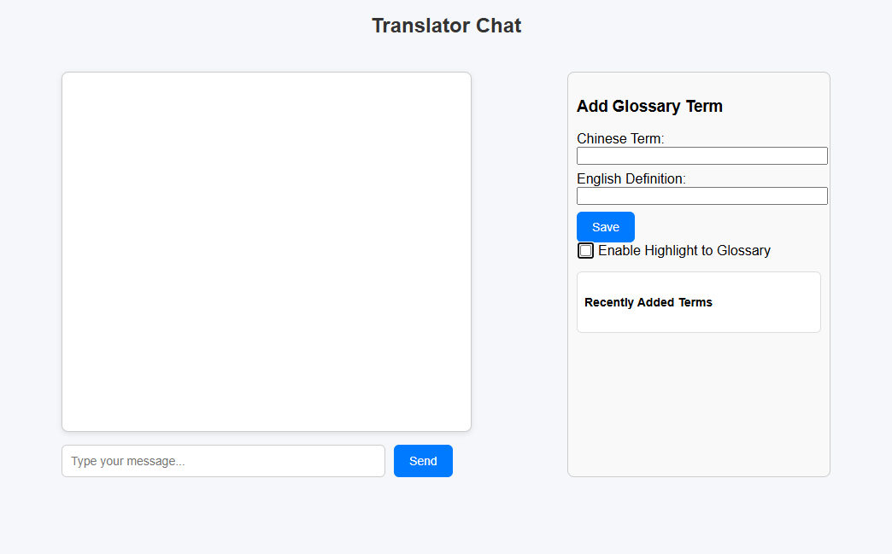

# LLM-based RAG Translator

This project is a prototype LLM-based RAG translator built for a client.
It uses the client’s custom glossary to enforce preferred terminology during translation.

The system runs locally with Ollama or other LLM backends, ensuring no **third-party cloud services** are used. This protects proprietary information and meets the client’s privacy requirements.

## Requirements
 - [Python 3.10+](https://www.python.org/downloads/)
 - [Ollama (local LLM engine)](https://ollama.com)

**Recommended: virtual environment (e.g. venv or conda)**

1. Follow the official instructions on the Ollama website.
2. Verify you have installed Ollama with the command `ollama --version`
3. Pull a model with `ollama pull deepseek-v2:16b` or [any other model](https://ollama.com/search)

## Usage

In progress